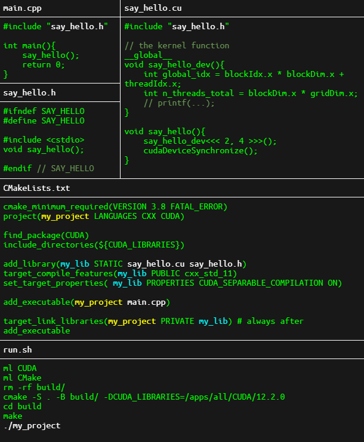

# Cheatsheet
## Makefile C++ main and CUDA kernel
Original task from https://code.it4i.cz/training/cuda_2022/-/tree/main/hello_world, but my task was a to create and run it in files main.cpp, say_hello.cu and say_hello.h
